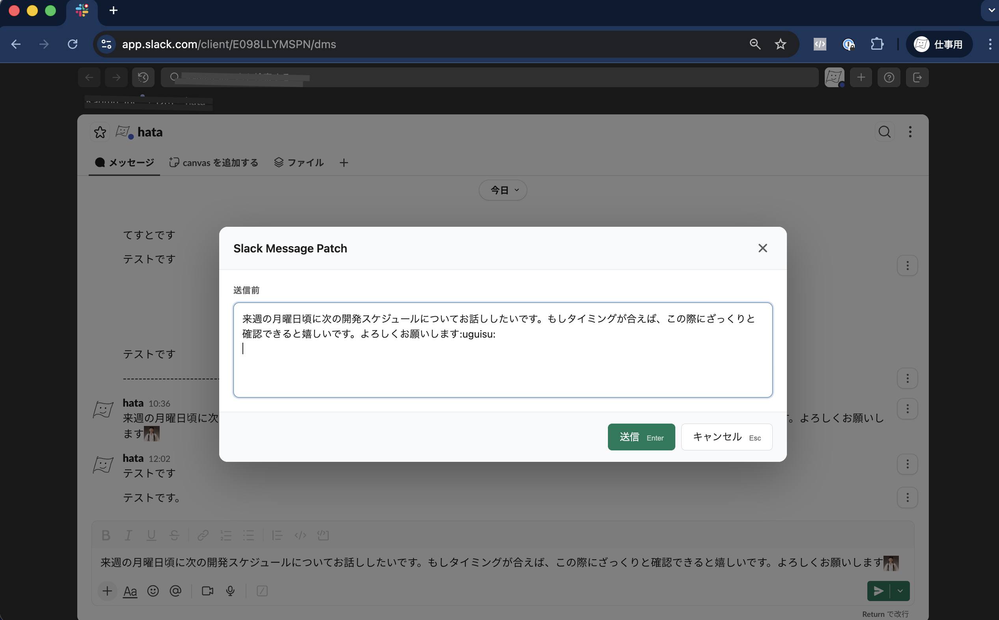
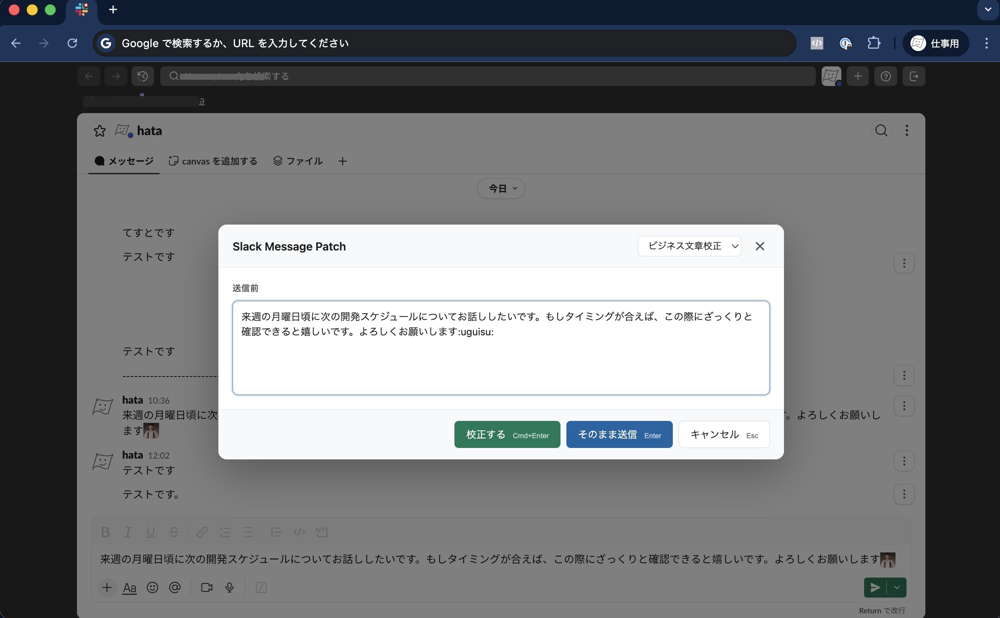
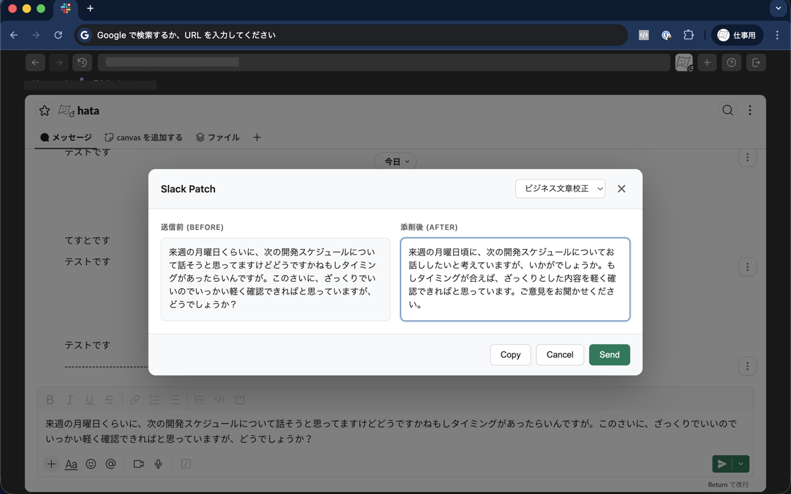
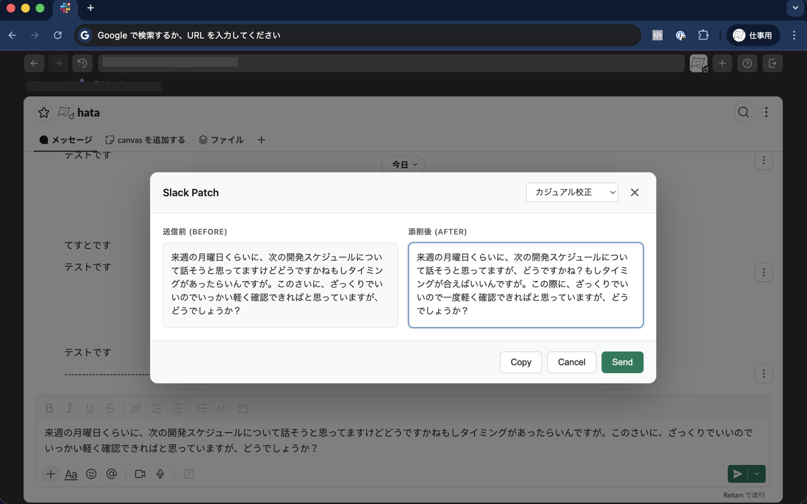

# Slack Message Patch

Web版Slackで送信前メッセージを確認・編集し、オプションでLLMによる添削機能も使えるChrome拡張機能です。

## 機能

- **送信前確認**: `Cmd+Enter` (Mac) / `Ctrl+Enter` (Windows/Linux) でメッセージを確認・編集してから送信
- **LLM添削（オプション）**: OpenAI APIキーを設定すると、LLMによる文章校正機能が使用可能
- **Before/After比較**: 元のテキストと添削後テキストを並べて表示
- **編集可能**: テキストはその場で編集可能
- **プリセット管理**: 複数のプロンプトプリセットを登録・切り替え可能
- **Shadow DOM**: Slack UIとのCSS衝突を回避

## インストール

### 開発版

1. リポジトリをクローン
   ```bash
   git clone https://github.com/kanmu/slack-patch-chrome-extension.git
   cd slack-patch-chrome-extension
   ```

2. 依存関係をインストール
   ```bash
   pnpm install
   ```

3. ビルド
   ```bash
   pnpm build
   ```

4. Chrome拡張機能として読み込み
   - Chrome で `chrome://extensions` を開く
   - 「デベロッパーモード」を有効化
   - 「パッケージ化されていない拡張機能を読み込む」をクリック
   - `dist` フォルダを選択

## セットアップ

1. 拡張機能のオプションページを開く（拡張機能アイコンを右クリック → オプション）
2. （オプション）OpenAI APIキーを入力 - LLM校正機能を使用する場合のみ
3. （オプション）使用するモデルを選択（デフォルト: gpt-4o-mini）
4. 必要に応じてプリセットを追加・編集

> **Note**: APIキーを設定しなくても、送信前確認・編集機能は使用できます。

## 使い方

### 送信前確認モード（APIキー未設定時）

1. Web版Slack (`app.slack.com`) でメッセージを入力
2. `Cmd+Enter` (Mac) / `Ctrl+Enter` (Windows/Linux) を押す
3. メッセージを確認・編集して「送信」



シンプルに送信前確認と編集ができます。誤送信防止に便利です。

### LLM校正モード（APIキー設定時）

#### 1. メッセージを入力してショートカットを押す

Web版Slack (`app.slack.com`) でメッセージを入力し、`Cmd+Enter` (Mac) または `Ctrl+Enter` (Windows/Linux) を押します。


#### 2. 校正するか選択

確認モーダルが表示されます。「校正する」でLLM校正を実行、「そのまま送信」で校正せずに送信できます。



#### 3. Before/After を確認・編集

「校正する」を選択すると、添削結果がモーダルで表示されます。左側が元のテキスト、右側が添削後のテキストです。添削後テキストはその場で編集できます。



#### 4. プリセットを切り替える

モーダル右上のドロップダウンからプリセットを切り替えられます。切り替えると再度添削が実行されます。



#### 5. 送信またはキャンセル

- **送信**: 添削後テキストをSlackの入力欄に反映して送信
- **コピー**: 添削後テキストをクリップボードにコピー
- **キャンセル**: キャンセルしてモーダルを閉じる

## プリセット管理

オプションページでプリセットを管理できます。

### プリセット一覧


### 新しいプリセットを追加

「+ 新しいプリセットを追加」からカスタムプリセットを作成できます。


## デフォルトプリセット

- **ビジネス文章校正**: 丁寧かつ簡潔に校正
- **カジュアル校正**: カジュアルな雰囲気を保ちつつ校正

## 開発

### 開発モード（ホットリロード）

```bash
pnpm dev
```

### ビルド

```bash
pnpm build
```

### プロジェクト構成

```
slack-patch-chrome-extension/
├── manifest.json           # Manifest V3設定
├── src/
│   ├── content/           # Content Script
│   │   ├── index.ts       # エントリポイント
│   │   ├── slack-dom.ts   # Slack DOM操作
│   │   ├── modal.ts       # モーダルUI
│   │   └── styles.css     # モーダルスタイル
│   ├── background/
│   │   └── service-worker.ts  # Service Worker (LLM API呼び出し)
│   ├── options/           # 設定画面
│   ├── types/             # 型定義
│   └── utils/             # ユーティリティ
├── icons/                 # 拡張アイコン
└── dist/                  # ビルド出力
```

## 対応フォーマット

Slackのリッチテキストフォーマットに対応しています:

| フォーマット   | 変換形式       | 対応状況 |
| -------------- | -------------- | -------- |
| **太字**       | `*text*`       | ✅        |
| *イタリック*   | `_text_`       | ✅        |
| `コード`       | `` `text` ``   | ✅        |
| ~~取り消し線~~ | `~text~`       | ✅        |
| コードブロック | ` ```text``` ` | ✅        |
| 引用ブロック   | `> text`       | ✅        |
| リンク         | `<URL\|text>`  | ✅        |
| 箇条書きリスト | `• item`       | ✅        |
| 番号付きリスト | `1. item`      | ✅        |
| 絵文字         | `:emoji:`      | ✅        |

## 注意事項

- **プライバシー**: LLM校正機能を使用する場合、入力したメッセージはOpenAI APIに送信されます。機密情報の取り扱いにご注意ください。
- **プライベートチャンネル**: プライベートチャンネル（外部連携チャンネル）ではLLM校正機能は利用できません。送信前確認・編集機能のみ使用可能です。
- **APIキー**: APIキーはローカルストレージに保存され、ページに露出しません。

## ライセンス

MIT
